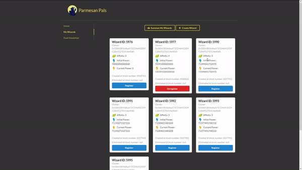
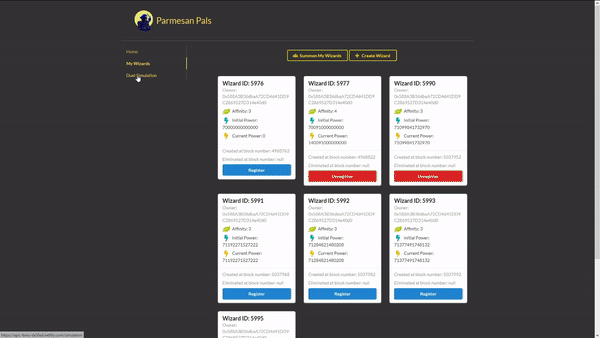
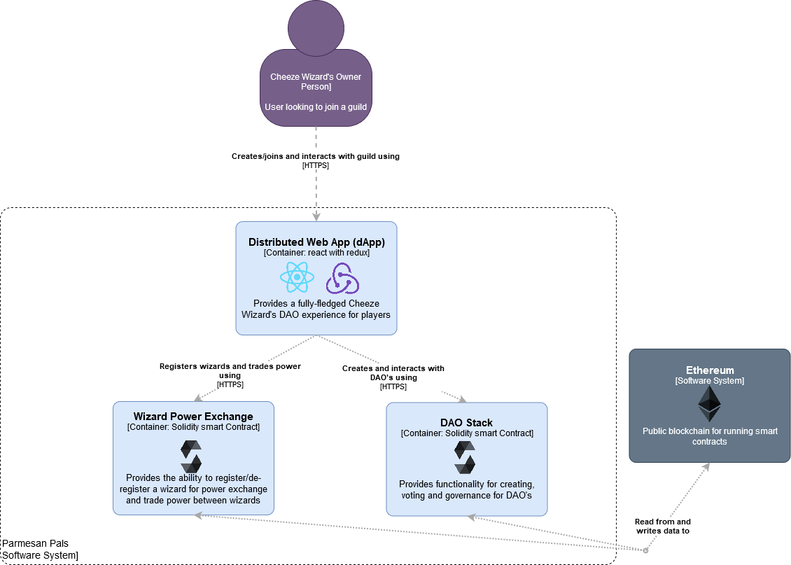

<p align="center">
  
</p>

# Parmesan Pals

Parmesan pals is an extension to the [Cheeze Wizards](https://www.cheezewizards.com/) blockchain game in which players summon Wizards (as [NFT's](https://decentraland.org/blog/technology/what-are-nfts/)) to fight in magical duels and compete to become the Big Cheeze..

Parmesan Pals allows wizard to form guilds, aggregating their power and giving them the ability to crush enemies in Cheeze Wizard tournuments.

Any Cheeze Wizard can form a guild and then invite other's to join that guild, either for a fee or for free. Each guild represents a DAO (built using [DAOStack](https://daostack.io/)) for allowing the guild to be self-governed.

Once wizards are inside the guild they can then vote on actions the guild should take, with their vote weight being reputation depedendant. While participating in tournuments, the wizards can freely trade power with each other (either complete power transfers or partial power transfers, if wizards have excess power they want to sell off).

Guids can also wage war against other guilds, with a vote taking place first to form a consensus within each guild whether battle should take place and the rules of the battle. This can let guilds take power from other guilds or compete over other valuables items.

### Technologies used
- Ethereum Blockchain for smart contracts
- DAOStack (to be implemented) for creation of cheeze wizard DAO's

### Demo
You can try Parmesan Pals [here](https://epic-benz-da50ed.netlify.com/).

### Power exchange registration

<p align="center">
  
</p>

Wizards can be registered for power exchange through the **My Wizards** tab, and set a price to charge per unit of power sold. This will let any other wizard in the guild purchase power from your wizard.


### Power exchange

<p align="center">
  
</p>

You can exchange power, for ETH, with any registered wizard using the **Duel Simulation** tab. Simply select the wizard in your wallet to which you want power to be transferred, and then select the wizard you want to purchase power from. 

When you click **Generate Possible Duel Results**, all the possible power transfers will be listed and you will be able to see how much this power transfer will cost. Once you've selected an amount of power to purchase, clicking **Duel** will initiate the power transfer (to be implemented).


## Application Architecture
---

<p align="center">
  
</p>

### Testing
The tests for the **WizardPowerExchange.sol** can be found in the **test/WizardPowerExchangeTests.js** file.

The tests can be run by first starting an etherlime ganache instance using
```
etherlime ganache
```
and then running the tests using
```
etherlime test
```

### Deployment
The contracts can be deployed using 
```
etherlime deploy
```
This will output the contract addresses which need to be inserted into **configuration/index.js** 

### Launching
Install the node modules by running
```
npm install
```
The application can then be run by using the command
```
yarn start
```

# Contribution

PR's are more than welcome.